# VCPChat 项目架构文档

## 变更记录 (Changelog)

- 2025-10-17 15:39:00: 完善架构文档，增强技术实现细节和模块间交互说明
- 2025-09-30 19:47:17: 初始化架构分析，创建根级和模块级文档

## 项目愿景

VCPChat 是一个为 VCP (Variable & Command Protocol) 服务器打造的革命性 AI 聊天桌面客户端，旨在成为强大 AI 后端生态的"眼睛"和"画板"，提供极致的多媒体渲染能力、实时协同编辑和丰富的交互体验。它不仅仅是一个聊天应用，更是一个完整的 AI 协作开发平台。

## 架构总览

VCPChat 采用 Electron 桌面应用架构，融合了 Node.js 后端和丰富的 Web 前端技术，实现与 VCP 后端的深度协同。应用采用多层架构设计，确保高性能、可扩展性和模块化开发。

### 技术栈概览
- **前端框架**: Electron 37+ (跨平台桌面应用，支持最新的 Web API)
- **后端运行时**: Node.js + Python (专业级音频引擎，支持高保真音频处理)
- **UI 技术**: HTML5, CSS3, JavaScript (ES6+) + 现代前端框架
- **通信协议**: HTTP/WebSocket (与 VCP 服务器通信，支持流式传输)
- **数据存储**: 本地文件系统 (AppData 目录) + 增量同步机制
- **多媒体**: Sharp 图像处理 + 自定义音频引擎 + WebAssembly 支持
- **协同编辑**: Operational Transformation (OT) + CRDT 算法

### 核心架构特点
1. **模块化设计**: 采用功能模块化的架构，每个功能模块独立管理，松耦合高内聚
2. **分布式扩展**: 内置 VCPDistributedServer，可作为 VCP 分布式网络节点，支持插件生态
3. **多媒体处理**: 专业级音频引擎和强大渲染引擎，支持多种媒体格式和实时处理
4. **插件生态**: 丰富的插件系统支持各种 AI 工具和媒体处理，可动态扩展
5. **实时协同**: 支持多用户实时编辑，零延迟同步，像 Google Docs 一样的协作体验
6. **AI 深度集成**: 完整的 VCP 协议支持，支持多 Agent 协作和长期记忆
7. **跨应用体验**: 全局文本选择和智能助手，在任何应用中都能获得 AI 服务

## 模块结构图

```mermaid
graph TD
    A["(根) VCPChat"] --> B["modules"];
    A --> C["Assistantmodules"];
    A --> D["Musicmodules"];
    A --> E["Voicechatmodules"];
    A --> F["Canvasmodules"];
    A --> G["Themesmodules"];
    A --> H["Dicemodules"];
    A --> I["Notemodules"];
    A --> J["Groupmodules"];
    A --> K["Translatormodules"];
    A --> L["VCPDistributedServer"];
    A --> M["VCPHumanToolBox"];
    A --> N["styles"];
    A --> O["assets"];
    A --> P["vendor"];

    B --> B1["chatManager.js"];
    B --> B2["messageRenderer.js"];
    B --> B3["fileManager.js"];
    B --> B4["settingsManager.js"];
    B --> B5["uiManager.js"];

    L --> L1["Plugin"];
    L --> L2["VCPDistributedServer.js"];

    M --> M1["WorkflowEditormodules"];
    M --> M2["ComfyUImodules"];

    click B "./modules/CLAUDE.md" "查看核心模块文档"
    click C "./Assistantmodules/CLAUDE.md" "查看AI助手模块文档"
    click D "./Musicmodules/CLAUDE.md" "查看音乐模块文档"
    click E "./Voicechatmodules/CLAUDE.md" "查看语音聊天模块文档"
    click F "./Canvasmodules/CLAUDE.md" "查看画布模块文档"
    click G "./Themesmodules/CLAUDE.md" "查看主题模块文档"
    click H "./Dicemodules/CLAUDE.md" "查看骰子模块文档"
    click I "./Notemodules/CLAUDE.md" "查看笔记模块文档"
    click J "./Groupmodules/CLAUDE.md" "查看群聊模块文档"
    click K "./Translatormodules/CLAUDE.md" "查看翻译模块文档"
    click L "./VCPDistributedServer/CLAUDE.md" "查看分布式服务器文档"
    click M "./VCPHumanToolBox/CLAUDE.md" "查看人类工具箱文档"
```



## 模块索引

| 模块名称 | 路径 | 主要职责 | 技术栈 | 入口文件 | 核心特性 |
|---------|------|----------|--------|----------|----------|
| **核心模块** | modules/ | 聊天管理、消息渲染、文件管理等核心功能 | JavaScript ES6+ | chatManager.js | 21种消息渲染器、流式处理、IPC通信 |
| **AI助手系统** | Assistantmodules/ | 智能划词助手、Agent管理、AI交互增强 | HTML5/CSS3/JS | assistant.html | 全局文本监听、跨应用操作、独立对话窗口 |
| **协同画布** | Canvasmodules/ | 革命性的实时协同编辑空间、全功能IDE | HTML5/CSS3/JS | canvas.html | 零延迟同步、沙盒代码执行、版本控制系统 |
| **音乐系统** | Musicmodules/ | 专业级音乐播放、歌词显示、音频处理 | HTML5/WebAudio | music.html | 高保真音频、实时歌词、音频可视化 |
| **语音聊天** | Voicechatmodules/ | 语音识别、语音输入、实时语音聊天 | WebRTC/Speech API | voicechat.html | 实时语音转文本、语音活动检测 |
| **主题系统** | Themesmodules/ | 动态主题管理、UI样式定制、壁纸管理 | CSS3/预处理器 | themes.html | 实时主题切换、动态样式生成 |
| **3D骰子系统** | Dicemodules/ | 物理引擎驱动的3D骰子、游戏功能 | Three.js/WebGL | dice.html | 真实物理模拟、多种骰子类型 |
| **知识管理** | Notemodules/ | 智能笔记管理、知识库集成、RAG系统 | Markdown/JS | notes.html | 知识图谱、语义搜索、自动分类 |
| **群组协作** | Groupmodules/ | 多Agent群聊、团队协作、任务管理 | WebSocket/JS | groupchat.js | 实时群聊、Agent协作、任务分配 |
| **翻译系统** | Translatormodules/ | 多语言翻译、跨语言交流 | 翻译API/JS | translator.html | 实时翻译、语言检测、语境理解 |
| **分布式网络** | VCPDistributedServer/ | VCP分布式节点、插件系统、工具注册 | Node.js/Python | VCPDistributedServer.js | 插件生态、跨节点通信、负载均衡 |
| **人类工具箱** | VCPHumanToolBox/ | 工作流编辑器、ComfyUI集成、AI工具链 | HTML5/Node.js | index.html | 可视化工作流、AI管道编排 |
| **样式架构** | styles/ | 全局样式系统、设计令牌、动画系统 | CSS3/PostCSS | base.css | 设计系统、响应式布局、动画库 |
| **资源管理** | assets/ | 图片、图标、壁纸、多媒体资源 | 多媒体格式 | - | 静态资源管理、动态资源加载 |
| **第三方生态** | vendor/ | 外部依赖库、CDN资源、开发工具 | 多种技术 | - | 模块化依赖、版本管理、性能优化 |

## 模块间交互关系

### 核心依赖关系
```
主进程 (main.js)
    ↓ 管理和协调
├── 核心模块 (modules/) ──────→ 提供基础功能
├── AI助手 (Assistantmodules/) ─→ 增强用户交互
├── 协同画布 (Canvasmodules/) ─→ 提供编辑环境
├── 分布式服务器 (VCPDistributedServer/) ─→ 扩展网络能力
└── 其他功能模块 ─────────────→ 提供专项功能
```

### 数据流向
```
用户输入 → UI层 → 核心模块 → VCP服务器 → AI处理 → 响应渲染 → 用户界面
    ↓         ↓        ↓         ↓         ↓         ↓         ↓
划词助手 → 消息处理 → 文件管理 → 协议转换 → 插件执行 → 画布渲染 → 主题应用
```

### 通信机制
- **IPC通信**: 主进程与渲染进程间的高性能通信
- **WebSocket**: 与VCP服务器的实时双向通信
- **插件系统**: 分布式服务器与插件间的标准化通信
- **文件监听**: 实时文件变化监听和同步机制

## 运行与开发

### 环境要求
- Node.js (推荐最新 LTS 版本)
- Python 3.8+ (音频引擎)
- Git

### 安装步骤
```bash
# 克隆仓库
git clone https://github.com/lioensky/VCPChat.git
cd VCPChat

# 安装 Node.js 依赖
npm install

# 安装 Python 依赖
pip install -r requirements.txt

# 安装音频重采样模块 (可选，推荐)
pip install audio_engine/rust_audio_resampler-0.1.0-cp313-cp313-win_amd64.whl
```

### 启动方式
```bash
# 常规启动
npm start

# 打包应用
npm run pack

# 构建发布包
npm run dist
```

### 开发工具
- 主进程调试: `Control+Shift+I` 打开开发者工具
- 数据管理: 使用 VchatManager 可视化管理工具
- 插件开发: 参考 VCPDistributedServer/Plugin/ 目录下的示例

## 测试策略

### 测试覆盖范围
- 核心聊天功能: 消息发送接收、渲染、文件处理
- 模块功能: 各个功能模块的独立测试
- 插件系统: 分布式插件加载和执行测试
- 音频引擎: 音乐播放、语音处理测试
- 跨平台兼容性: Windows/macOS/Linux 兼容性测试

### 测试环境
- 开发环境: 本地 Electron 应用测试
- 集成测试: 与 VCP 后端服务器的集成测试
- 性能测试: 大量消息处理、多媒体渲染性能测试

## 编码规范

### JavaScript 规范
- 使用 ES6+ 语法特性
- 模块化设计，避免全局变量污染
- 错误处理机制完善
- 代码注释清晰，特别是复杂逻辑部分

### HTML/CSS 规范
- 语义化 HTML 标签使用
- 响应式设计，适配不同窗口大小
- CSS 模块化，避免样式冲突
- 主题系统支持，便于定制

### 文件组织
- 功能模块独立目录
- 配置文件集中管理
- 资源文件分类存放
- 代码文档及时更新

## AI 使用指引

### AI Agent 配置
- 每个 Agent 独立配置系统提示和参数
- 支持多模态输入输出 (文本、图片、音频、视频)
- Agent 间协作和群聊模式
- 长期记忆和上下文管理

### VCP 协议支持
- 完整支持 VCP 工具调用
- 异步任务处理和回调
- Base64 多媒体数据处理
- 分布式文件 API 调用

### 插件开发指南
- 插件 manifest 配置
- IPC 通信机制
- 错误处理和日志记录
- 资源管理和释放

## 相关链接

- 后端项目: https://github.com/lioensky/VCPToolBox
- 壁纸包下载: https://github.com/lioensky/VCPChat/releases
- 音频解码包: https://github.com/lioensky/VCPChat/releases/tag/%E8%A7%A3%E7%A0%81%E5%99%A8core

---

*本文档由 AI 自动生成，最后更新时间: 2025-09-30 19:47:17*